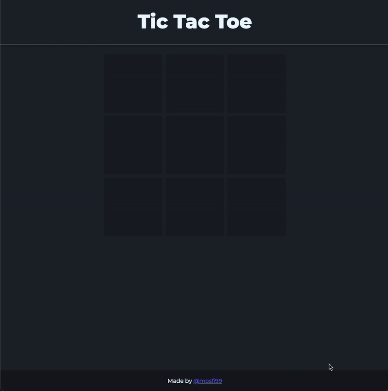

# Tic Tac Toe Game

Responsive and browser based, built with **vanilla JavaScript**, using **factory functions** and the **module pattern**. Styled with **Tailwind CSS** and **DaisyUI**.

This project was part of [The Odin Project’s JavaScript curriculum](https://www.theodinproject.com/lessons/node-path-javascript-tic-tac-toe), specifically the lesson on [factory functions and the module pattern](https://www.theodinproject.com/lessons/node-path-javascript-factory-functions-and-the-module-pattern). It helped me understand how to structure JavaScript code using encapsulation and modular design principles.

I also took this opportunity to go beyond the original requirements by learning and integrating **Tailwind CSS** and **DaisyUI** to build a clean and responsive UI. Since I already felt confident working with traditional CSS, I wanted to streamline the styling and layout process. This allowed me to shift more of my focus toward the JavaScript logic and DOM manipulation.

### About Factory Functions and the Module Pattern (IIFE)

- **Encapsulation**: Each module (e.g., `Gameboard`, `Game`, `Display`) is self-contained, managing its own data and logic.
- **Clear separation of concerns**: Game logic and DOM manipulation are split into dedicated modules.
- **Reusable and maintainable**: Functions can be reused or tested in isolation.

## 🛠 Tech Stack

- **JavaScript (ES6+)**
- **HTML5**
- **Tailwind CSS**
- **DaisyUI**
- **Modular Design with IIFE + Factory Functions**

## 📱 Mobile

## 💻 Desktop

